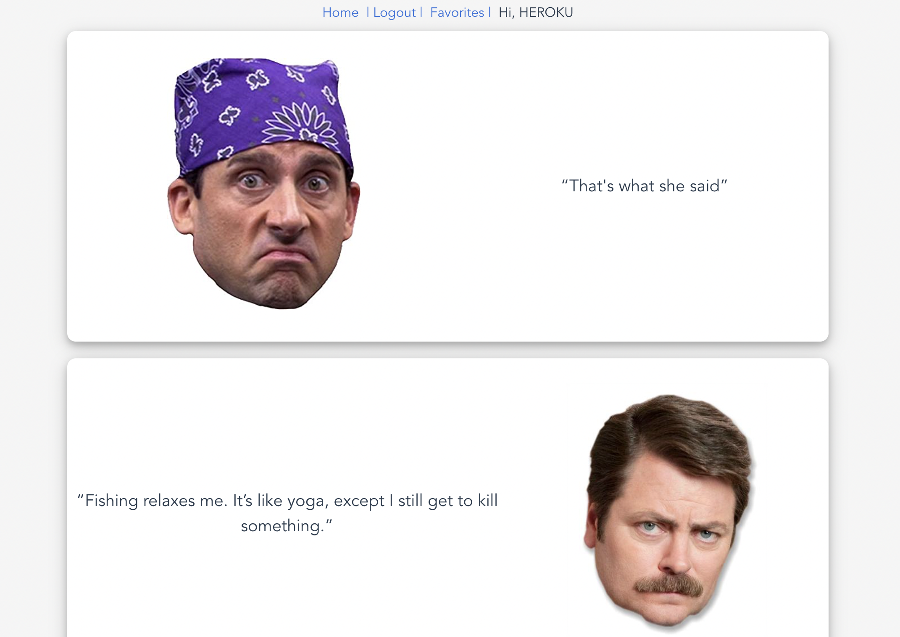
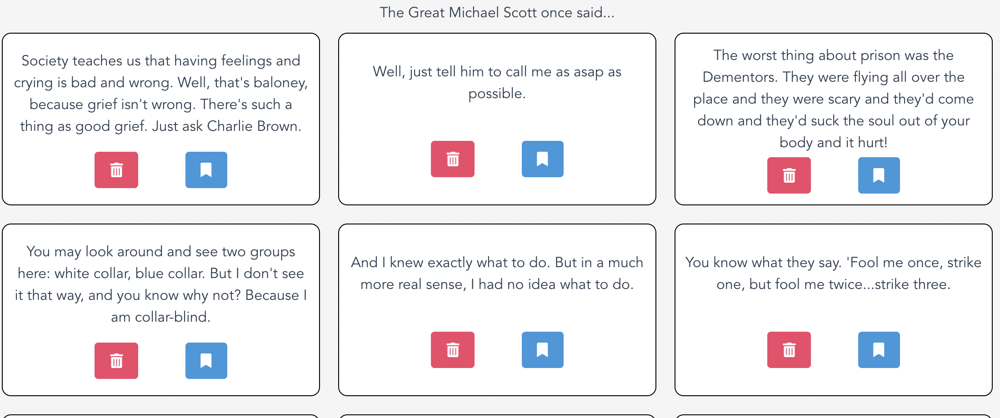

# Michael Scott Quotes

This is a Vue3 project that uses Vue's composition API. The project includes user authentication and protected user routes. If a user is logged in, they can see a page of Michael Scott or Ron Swanson Quotes.

A user can also add a quote to their favorites and view their favorite quotes.

## Technologies Used:

- Vue3
- Ruby on Rails API
- Vue Composition API
- Node.js/Express.js Cloudinary API
- Vue3-Router
- Yarn
- Git
- Bulma (CSS framework)
- Font Awesome
- JsonWebToken
- Express.js
- Heroku
- Axios
- Lodash

### Deployed App
[Click](https://office-client-vue.herokuapp.com/) to see the final app!

### Screenshots: 

### Short clip:
